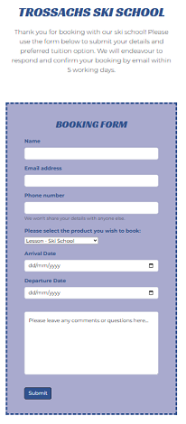
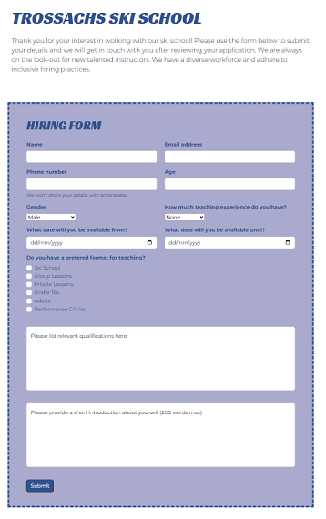
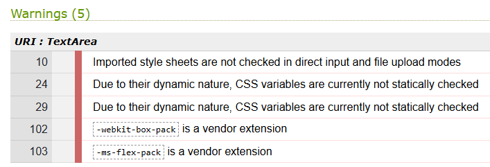

# Trossachs Ski School

## Project Description
This project is a website developed for a fictional organisation, Trossachs Ski School, based in Scotland, which has the primary business goal of attracting new customers and encouraging people to book ski instruction with the school. The site is targeted at ski enthusiasts who are interested in improving their skills with targeted tuition. It aims to provide prospective clients detailed information about the instructional products on offer, and provide a convenient and easy way for them to book according to their preferences.

The site is fully responsive so users can have a positive experience on any device, and it allows them to learn more about the school, the options on offer, and has a clear process for booking.

## Project Principles
1. **Mobile-first development:** The website has been designed with responsiveness in mind. All elements and structures were first created to fit mobile screens, with additional styling and classes to ensure responsiveness on larger screens. 
2. **User-centric development:** The user’s experience is taken into consideration at every step in the development process in order to make the end product as convenient and efficient as possible. 
3. **Accessibility:** Code used within the project is compliant with best practice for accessibility e.g. including alt values on all images, ensuring comments are used appropriately to provide context.
4. **Navigability:** Clear navigation is present on all pages of the site, allowing users to move to different areas within a single click.
5. **Visual hierarchy:** Visual design of the site clearly delineates different elements like headers, footers, forms etc. and is consistent across all pages.

## Business Goals
The primary business goal for the company is to increase the number of bookings they receive through the website.  
A secondary business goal for the company is to utilise the site to attract and hire new staff.

## Project Board
The project board functionality on GitHub was used extensively throughout the planning and development of the project. GitHub allows project managers to establish a series of tasks (with each task typically referring to one feature of the project) and ascribe priority level to each of these tasks. This prioritisation allowed me to focus on specific key features over others during the development process, and also helped to identify the point at which a minimum viable product was achieved. 

Link to project board: https://github.com/users/DTT2411/projects/4 

## User Stories
A series of user stories have been created to facilitate the development of the project. Acceptance criteria and tasks were assigned to each story which allows these to serve as a series of milestones which much be achieved to reach a minimum viable product. 

Priority tags (i.e. "must have", "should have" and "could have") were added to each user story to help prioritise the order in which these were tackled. 

### 1. As a holidaymaker on a budget, I want to see a list of the types of lessons available and their prices so that I can determine the best lesson option for my child. (Must Have)

**Acceptance Criteria:**
- The home page displays a list of the different types of lessons and instruction available, sorted by level
- Each item in the list includes the name, price, and a brief description
- The list is responsive and looks good on all devices

**Tasks:**
- Add an HTML section on the homepage dedicated to lesson types available
- Display pricing for different options
- Style the events using Bootstrap (cards, grid)
- Populate cards with details

### 2. As a local business owner, I would like to be able to quickly identify the contact details and information about the ski school so I can include this in recommendations to my own customers. (Must Have)

**Acceptance Criteria:**
- The site has a dedicated section for contact details, address and opening hours
- This section is visible and accessible from anywhere on the website

**Tasks:**
- Develop a section for contact details, address and opening hours 
- Ensure this section is visible on all pages, adhering to common design standards

### 3. As a potential booker, I want to see good quality images and descriptions about what is on offer so I can determine whether this is the school I want to commit to. (Must Have)

**Acceptance Criteria**
- Homepage features a hero image relevant to ski holidays/instruction
- Engaging descriptions of all lessons and clinics are displayed clearly and concisely 
- The pages are uncluttered and attractive

**Tasks:**
- Add high-quality hero image, and images for lesson/clinic cards
- Embed descriptions about the school and the lessons/clinics on offer within the site content
- Design and implement homepage layout with prominently featured images and descriptions

### 4. As a holidaymaker, I need a clear and easy-to-use form to book lessons for multiple people so that I can book lessons for our family. (Must Have)

**Acceptance Criteria:** 
- Add a booking form section to the homepage (or make it a separate page?) with fields for name, email, date and preferred type of instruction
- Accessed via button on main page - Call to Action
- Link the form to a success page to let customers know they have filled it out successfully
- The booking form and success page must be responsive and look good on all devices

**Tasks:**
- Create booking.html form section OR page with relevant input fields for name, email, date and a select drop-down list for instruction type
- Link output from form to a simple success page confirming form submission
- Utilise Bootstrap grid and classes to make the form responsive on all screen sizes

### 5. As a holidaymaker, I want to be able to navigate through the site easily on all types of devices so I can make bookings quickly. (Must Have)

**Acceptance Criteria:**
- Create navigation section within the header for each site page which allows users to click to navigate to various pages/sections, including “Home”, “Hiring”, “Lessons”
- “Book Now” call to action button
- When in a particular page, the name of the page stands out compared to other navigation links. Navigation is intuitive.

**Tasks:**
- Develop a Bootstrap navbar which is responsive on various screen sizes
- Ensure all pages and key sections are easily accessible from anywhere on the site

### 6. As a holidaymaker looking to book lessons, I want to read testimonials from others who have used the ski school so that I can feel confident when booking. (Should have)

**Acceptance Criteria:** 
- Website includes a testimonials section on the main page which displays past customer reviews
- The testimonials are clearly visible and are presented in a format that is easy to read, with key info (e.g. name, quote)

**Tasks:**
- Create section on homepage for customer testimonials
- Style the testimonials using Bootstrap (cards, grid) to ensure responsiveness
- Populate testimonials with sample comments and authors

### 7. As a qualified ski instructor, I want to see any employment opportunities and how to apply so that I can secure work with the ski school. (Should have)

**Acceptance Criteria:**
- Site has a dedicated “Hiring” page which provides information on the type of placements/work currently available
- Instructors interested in applying can submit their details via form to initiate a job application process

**Tasks:**
- Develop separate html page for Hiring
- Create and populate list of work placements open for application using Bootstrap cards
- Make list responsive

### 8. As a solo holidaymaker, I want to see a list of social events or group lessons open to singles so that I can have a good social experience. (Could have)

**Acceptance Criteria:** 
- The homepage has a dedicated section for social events with relevant details

**Tasks:**
- Create static section for a list of upcoming events/socials on the homepage
- Develop list with Bootstrap 
- Make list responsive

### 9. As a physically-impaired skier with specific needs related to the instruction, I want to see a list of the staff and their qualifications to determine whether the school can cater to my needs. (Could have)

**Acceptance Criteria:**
- Site has a dedicated “Our Staff” section or page which clearly displays the details of individual staff members and their training level.
- Staff information is laid out in an easily readable format which is responsive on all devices.

**Tasks:**
- Create separate “Our Staff” page 
- Make list responsive

## Wireframes
Balsamiq Wireframes software was used during the planning process to establish a general structure for each of the pages and sections of the project. 

While the wireframes helped to inform the structure of the project in early stages, and was generally well adhered to, during development several improvements on the wireframe designs were identified (e.g. formatting, layout and responsiveness of the contact & footer section) and implemented. Screenshots of all wireframes developed for each page and screen size can be seen below.

Significant changes between the structure indicated in the wireframes versus the end product include:
- Navigation bar items were changed to align to the right side of the bar rather than the left.
- Additional items were added to the navigation bar to help users navigate to lessons and clinics sections, and a link to the Testimonials page was also added after this had been developed.
- A single hero image spanning the full width of the header was implemented, rather than a carousel of different images.
- The details in the footer were compressed (e.g. social media links changed from list to icons and put within the contact details list, same with address) to make the footer less cramped, particularly on smaller screens.
- Split the date fields in the forms into arrival and departure dates since this would be more informative for both booking and hiring applications.
- Final product uses drop-down select menus rather than checkboxes, where possible, in booking and hiring forms to better utilise space.
- Differently styled border established around booking and hiring forms to distinguish these areas from the rest of the site.

Homepage  

Booking page  

Hiring page  

Form success page  

Testimonials page  

## Features

### Existing Features
#### 1. Navigation bar
The navigation bar appears at the top of the screen on all pages and contains links to major areas including the Lessons and Clinics sections on the homepage, as well as links to the Hiring and Booking forms and the Testimonials page. Where appropriate, the `active` class has been used to ensure that the current page is highlighted on the navigation bar. The navigation bar collapses into a drop-down menu on screens with lower than 992px (below desktop size). A Call to Action button is also superimposed on the bar in the right corner with custom styling to make this stand out to users. 

Up to 992px  

Over 992px  

#### 2. Homepage header & hero section
Directly below the navigation bar at the home page, a header and hero image area has been created. This area is covered by a responsive, high-quality hero image that stretches to fit the screen size. This image was used as a source for selecting a colour scheme for the website as a whole. The area also contains a title, subtitle and lead text intoducing the school at a glance, and this is superimposed over a semi-transparent colour block to make it readable against the image in the background. The font size of the lead text decreases below 768px screen size in order to prevent overflow.

#### 3. Homepage reasons section
The first element within the main area of the home page is the "Reasons" section, which provide users with several benefits of booking with this ski school. The reasons are kept punchy and concise, one short sentence each, with icons for visual guidance. The reasons section is responsive - on screens below 1200px the items appear stacked vertically, while on larger screens they split into two columns to better utilise space. 

Up to 1200px  

Over 1200px  

#### 4. Homepage lessons & clinics sections
Information about the instruction products on offer from the ski school are featured prominently on the main page. Bootstrap cards have been used to structure these sections, with custom styling applied to ensure they fit with the colour scheme and layout of the site. The cards are displayed responsively, taking up the full width of the screen on mobile, and splitting into two or four columns for medium (768px+) and large (1200+) screens. All cards contain a header image which is relevant to the type of instruction, as well as key information such as pricing, skill level requirement, group size and appropriate age.

Screenshots below are of the Lessons section - the same structure and styling is applied to the Clinics section.

Up to 768px  

768px to 1200px  

Over 1200px  

#### 6. Footer & contact information section
The contact information for the ski school appears in a separate footer section, and this is applied consistently across all pages. The footer contains key contact information including the school's address, email address, phone number, and social media links. A table containing the school's opening times has also been included in this section. Icons have been included beside contact fields for visual guidance, as well clickable icons for the social media accounts. The footer is responsive, with the contact details and opening times stacking vertically on small screens, and horizontally on larger screens for the best utilisation of screen space.

Up to 992px  

Over 992px  

#### 7. Booking form
By clicking one of the CTA "Book Now" buttons on the main page, the user is taken to a separate booking page with a short introduction and a form area. The form has fields which takes key information from the user including their name, contact details, the type of product they wish to book, and the dates between which they wish to receive instruction. There is also an open textarea for any comments or questions which the customer may wish to leave. Custom styling (dashed line, adhering to colour scheme) has been applied to distinguish the form from other elements on the site. The booking form is responsive, spanning over smaller screens and splitting into two and three columns of fields on medium and larger screens respectively. 

Up to 768px  

768px to 1200px  

Over 1200px  

#### 8. Hiring form
The hiring form is accessible via the "Hiring" link in the navigation bar. The structure, styling and responsive properties of the form are consistent with the booking form. There are additional fields in the hiring form including: a drop-down list for the applicant's experience level; a checkbox list for any teaching preferences; an open text entry box for qualifications; and another text entry box for a short introductory statement.

For the purposes of avoiding duplication, only one screenshot of the hiring form has been provided below since it adopts a similar structure to the booking form above. 

#### 9. Form success page
A simple form success page has been designed to make it obvious to the user when their form data has been successfully submitted. A text box containing a short thank you message appears above a button which takes the user back to the homepage. 

#### 10. Testimonials page
The Testimonials page can be accessed via the relevant link in the navigation bar from anywhere on the site. The page is titled and includes short introductory lead text. Figures and captions have been used to create the testimonials themselves - the customer's comment appears above a hard line break, followed by the customer's name and date of submission. Quote icons have also been used for visual guidance, making it clear that these are direct quotes from other customers. The page is responsive, with the testimonial figures spanning the screen on smaller devices and breaking up into two columns for larger screens. 

Up to 992px  

Over 992px  

### Features to implement
1. **"Our staff" page:** One of the "could-have" features identified during project planning was to include a dedicated page to introducing staff at the ski school. Bootstrap cards and grid could be used to create cards for each staff member and instructor, although I would need to consider how to differentiate these from the cards in the Lessons and Clinics areas. The cards would contain details about the staff member including name, short background description, and (importantly) any qualifications the individual has, in particular any which would allow them to instruct physically impaired clients. 

2. **Social events page:** Another "could-have" feature identified during conception was for a page of social events/sessions run by the ski school, to address needs of users who may be coming to the organisation not only for instruction but for the opportunity to connect with others with similar interests. 

3. **Testimonials carousel:** While the current Testimonials page is functionally sound, after implementation and review I am not completely happy with the appearance - I feel it looks blocky and uninteresting as it stands. One option to liven this element up would be to have a single carousel for testimonials, with controls to move between different testimonials. If I were to implement this, I would probably change the site structure by removing the separate Testimonials page and instead have this as another section on the main page, most likely underneath the Clinics section. 

4. **Key information page:** While this was not established as a potential feature during design, after implementing and reviewing the site, and from comments made by those I have asked to review the site, a dedicated area or page for key information pertaining to the school would be helpful. This would include information that is too wordy/specific to include in the contact/footer area, such as: FAQ on what equipment people should bring vs what they can hire; meeting points for ski school and other classes; emergency contact details; helpful information e.g. where to get lift passes, best restaurants in resort.

## Testing

Testing was conducted throughout the development cycle of the project, using the deployed version of the website as this was deployed at a very early stage. DevTools was utilised extensively to facilitate the testing of the site's responsiveness on different screen sizes (phone, tablet, laptop, desktop) in accordance with industry standard breakpoints (https://getbootstrap.com/docs/5.3/layout/breakpoints/#available-breakpoints).

Both manual testing an validator testing were used to identify potential bugs and inefficiencies in the project code.

### Validator Testing

#### HTML
1. Homepage: No errors.
2. Booking page:
    - *Stray end tag*: A stray `/form` tag which had been missed, resolved by deleting the relevant line. 
    - *Duplicate ID*: Duplicate name and ID of the phone number input field due to me copying but not amending, resolved by changing both to `phone`.
3. Hiring page:
    - *Stray end tag*: Same issue as booking page with the stray `/form` tag and duplicate name/ID of name and phone number inputs, resolved in the same way as above.
    - *Duplicate ID*: Duplicate name and ID of date fields - resolved by splitting into `arrival-date` and `departure-date` respectively.
    - *"The first child `option` element of a `select` element with a `required` attribute, and without a size attribute whose value is greater than `1`, must have either an empty `value` attribute or must have no text content."*: This was caused because, prior to testing, the first value was defined as `value="None"`, rather than empty. Resolved by amending to `value=""`.
    - *"The value of the for attribute of the label element must be the ID of a non-hidden form control"*: This error was thrown up for the teaching preferences checkbox list because a label was being applied to a `div` via the `for` attribute - this only works on `input` elements, not divs. This was resolved by changing the label to a simple `p` element, and adding the `form-label` class to ensure it kept the same styling as other labels in the form. 
4. Success page: No errors.
5. Testimonials page: 
    - *"Unclosed element `div`"*: Missing end tag for the main div element, resolved by adding a `/div` closing tag before the closing section tag. 

#### CSS
No bugs reported.
5 warnings were reported. 
  
10 - Highlights Google Fonts library as external so cannot be checked, can be safely ignored  
24 - Pertains to use of CSS variables, can be safely ignored  
29 - Pertains to use of CSS variables, can be safely ignored  
102 - Result from autoprefixer, can be safely ignored  
103 - Result from autoprefixer, can be safely ignored  

Since none of the warnings were unexpected or any cause for concern, no action was taken to resolve these. 

### Resolved Bugs from Manual Testing
- Testimonials page did not appear active on navigation bar when on the page. Simple fix by changing the element with the `active` class.
- I noticed that on smaller screens, the label for textareas in the hiring and booking form was extending beyond the edge of the text box. This was particularly pronounced on phone size screens. I used DevTools to inspect the label element and was able to identify a `white-space: nowrap` attribute which was causing the issue. I looked this attribute up since I wasn't familiar with it and was able to find an alternative attribute `white-space: normal` which fixed the issue. The textarea labels now word wrap appropriately on smaller screens. 

### Unfixed Bugs
- All bugs identified during manual and validtor testing were resolved.

### Deployment
The site was deployed to GitHub pages. The steps to deploy are as follows:
- In the GitHub repository, navigate to the Settings tab.
- From the source section drop-down menu, select the Master Branch.
- Once the master branch has been selected, the page will be automatically refreshed with a detailed ribbon display to indicate the successful deployment.

The direct link to the deployed page can be found here - https://dtt2411.github.io/CI-Portfolio-Project-1/.

## Credits

### Content
- Bootstrap was used extensively across the site, both in terms of bootstrap structures (e.g. grid, table, form) copied directly from Bootstrap guidance and customised, as well as the use of general Bootstrap classes (e.g. text-center, my-4). Utilisation of bootstrap classes facilitated a reduction in the CSS styling required. https://getbootstrap.com/docs/5.3/getting-started/introduction/.
- Google Fonts for custom fonts used throughout site. Link to embed code used: https://fonts.googleapis.com/css2?family=Montserrat:ital,wght@0,100..900;1,100..900&family=Racing+Sans+One&display=swap'.
- Typ.io (https://typ.io/) was used for inspiration on matching fonts for a sporty, active website. 
- Browser favicons were identified and downloaded from https://www.flaticon.com/.
- Reference to Love Running and Boardwalk Games modules from CI full stack course were used for guidance on general structure and layout.
- Icolour pallete (https://icolorpalette.com/palette-by-themes/ski) and Coolors (https://coolors.co/) were used for inspiration for colour schemes. 
- Image Color Picker (https://imagecolorpicker.com/) was used to match the site's colour scheme with the hero image on the homepage section by pulling out a variety of hex values present in the image.
- Amiresponsive (https://ui.dev/amiresponsive) was used to generate the mock-up image for the readme. 
- Balsamiq Wireframes (https://balsamiq.com/) was used extensively during planning to guide the structure and layout of the website. 
- Took guidance from Stackoverflow on how to semantically arrange testimonials section with figures, blockquotes and captions (https://stackoverflow.com/questions/1130565/correct-way-to-mark-up-testimonials-in-html).
- W3C HTML Validator (https://validator.w3.org/#validate_by_input) was utilised extensively during testing.
- W3C CSS Validator (https://jigsaw.w3.org/css-validator/#validate_by_input) was also used during testing.
- Autoprixer (https://autoprefixer.github.io/) was used to ensure portability of styles across different browsers. 

### Media
- Images were sourced from Pexels (https://www.pexels.com/) and Pixabay (https://pixabay.com/). All images used within the site are free-use, no royalties.
- Font Awesome for iconography, link to personal kit: https://kit.fontawesome.com/3af9805755.js 
